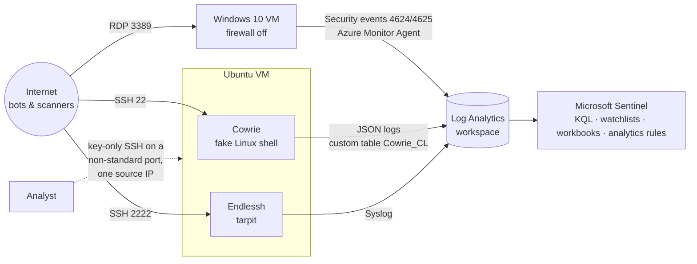

# SOC Home Lab: Azure Honeypots with Microsoft Sentinel

I exposed three honeypots to the internet in Microsoft Azure and fed everything into Microsoft Sentinel. In about 37 hours they recorded **1,239,818 attack attempts from 75 IPs**. Not one got into a real system. Along the way I captured three malware families, reconstructed a full Linux intrusion chain, and built detections for the attacks I saw. The lab cost about **$4.50 a day**.

**[View the interactive dashboard →](https://notkornflakes.github.io/SocHomelab/)**
· [Full write-up on Medium](https://medium.com/@no1listeninghere/open-door-policy-what-a-37-hour-honeypot-cost-me-vs-what-it-cost-them-428698cdf050)

> Collection window: Oct 3, 4:08 PM to Oct 5, 5:31 AM ET (US Eastern), 2026.

---

## Headline results

| Metric | Result |
| --- | --- |
| Time to first attack | About 1 hour after the VM went live |
| Total attempts | 1,239,818 (1,234,705 RDP · 5,113 SSH) |
| Unique source IPs / countries | 75 / 22 |
| Concentration | 95% of all attempts came from just 3 IPs |
| Fastest attacker | 448,700 RDP guesses in one hour (about 125 per second) from one Korea Telecom IP |
| Usernames that did not exist | 99.998% of failed RDP logins |
| Malware captured | Panchan (crypto miner), plus Mirai and Bashlite IoT botnet payloads |
| Successful logins to real systems | **None**. Only my own key-based logins |
| Cost | About $4.50/day (two VMs, disks, IPs; Sentinel on free trial) |

## Architecture



| Sensor | Exposure | What it answers |
| --- | --- | --- |
| Windows 10 VM | RDP 3389, host firewall disabled | Who attacks, how fast, guessing which usernames |
| Cowrie (medium interaction) | SSH 22 | What attackers do after they think they are in |
| Endlessh (tarpit) | SSH 2222 | How long automated tools wait on a server that never finishes connecting |

**Safeguards:** real admin access ran key-only on a non-standard port, restricted by NSG to one IP. The two VMs sat in separate resource groups and virtual networks. Captured malware was never executed and never left the quarantine folder.

## Key findings

**1. Volume is dominated by a few machines.**
Three IPs made 95% of the 1.24 million attempts. The largest, a Korea Telecom address, made 783,667 attempts in about 3 hours and peaked at 448,700 in a single hour. Because it sits on an ISP network rather than a hosting provider, it is most likely a compromised device. The second largest was a rented Hetzner server in Germany that tried 5,054 different usernames.

**2. Every attempt failed, and the logs show why.**
Windows records why each login fails. 1,233,774 failures were for usernames that did not exist. Azure renames the built-in Administrator account at setup, so the most-guessed name in the dataset was aimed at an account that was not there. The only real accounts guessed were the disabled built-in `Guest` and `DefaultAccount`. My real admin account was never targeted.

**3. Attackers rotate infrastructure; tool fingerprints stay the same.**

| Fleet | IPs | Behavior |
| --- | --- | --- |
| 109.160.32.x | 9 | SSH shifts of about 40 minutes; 7 of the 9 stopped at exactly 500 attempts |
| 80.94.92.x · 92.118.39.x · 2.57.122.x | 9 across 3 blocks | Wrote the same honeypot-test script (`echo "xxxxxx"`), same SHA-256 every time |
| Google Cloud (35.246.x, 35.197.x, 34.105.x) | 3 | Started within 27 minutes of each other, about 6 attempts per minute each, ran 15 hours |

Blocking single IPs does nothing against this. Behavior and file hashes are the reliable anchor.

**4. The SSH intrusion chain was split across specialized bots.**

| Stage | What happened | Evidence |
| --- | --- | --- |
| Access | Dictionary guessing with usernames harvested from other servers (`zabbix`, `gitlab`, `cs202`, `leia_organa`) | Cowrie login events |
| Probe | Honeypot test, plus CPU, GPU and uptime checks | Same file hash from 9 IPs |
| Fetch | One-line dropper: `auth_ok` beacon, hide in `/tmp`, pull a script from a staging server with the bot's own SSH key, delete everything | Full session replay |
| Deliver | Payloads uploaded and launched with `nohup` from hidden folders | 13 files captured in quarantine |

**5. Three malware families in two days.**
A 30 MB binary disguised as `sshd` matched the **Panchan** crypto-mining botnet. Overnight, a hosting server in Amsterdam pushed eight 32-bit **ARM** binaries and two loader scripts, twice. ThreatFox lists one binary as a **Mirai** payload and one script as a **Bashlite** payload. ARM builds target routers and cameras, so the bot sprayed IoT malware at an x86 cloud server without checking what it was.

**6. Most scanners give up on a tarpit fast.**
Endlessh held 101 connections for 1.2 hours in total. The longest single hold was 1,061 seconds; most bots left after 20–40 seconds.

## MITRE ATT&CK mapping

| Tactic | Technique | Evidence |
| --- | --- | --- |
| Reconnaissance | T1595.001 Scanning IP Blocks | Sub-second port probes; Nmap/ZGrab banners |
| Reconnaissance | T1592 Gather Victim Host Information | Usernames built from the VM's hostname, which RDP exposes |
| Credential Access | T1110.001 Password Guessing | 783,667 attempts from one IP in 3 hours |
| Credential Access | T1110.003 Password Spraying | 5,054 usernames, about 7 guesses each, from one Hetzner server |
| Initial Access | T1078.001 Default Accounts | `Guest`, `DefaultAccount`, `admin` with an empty password |
| Execution | T1059.004 Unix Shell | One-line bash droppers |
| Discovery | T1082 System Information Discovery | `uname -a`, CPU/GPU checks |
| Defense Evasion | T1497.001 Sandbox Evasion: System Checks | `echo "xxxxxx"` honeypot test |
| Command and Control | T1105 Ingress Tool Transfer | `scp`/`wget`/`curl` payload fetches; SFTP uploads |
| Defense Evasion | T1036.005 Masquerading | Malware named `sshd` |
| Defense Evasion | T1564.001 Hidden Files and Directories | Dot-folders in `/tmp` |
| Defense Evasion | T1070.004 File Deletion | `rm -rf sshcfg key.ppk out_sh` |
| Impact | T1496 Resource Hijacking | Panchan crypto miner |

## Indicators of compromise (defanged)

| Type | Indicator | Context |
| --- | --- | --- |
| SHA-256 | `94f2e4d8d4436874785cd14e6e6d403507b8750852f7f2040352069a75da4c00` | Panchan miner disguised as `sshd` |
| SHA-256 | `941efe52eb858311653bf2c1e855555cf735896d500f11ea90aaf7e93d1faa3f` | ARM ELF, listed by ThreatFox as a Mirai payload |
| SHA-256 | `586960df8bf559ffbba600f11917a99baed4a875cb7faa5eabc060bcde67277b` | Loader script, listed by ThreatFox as a Bashlite payload |
| SHA-256 | `af77b643964afd794460d28ab8a11b0ec8790cd5463abfde126613a4f3bccd32` | Honeypot-detection script used by the probe fleet |
| URL | `hxxps://217.60.102[.]5/sh` | Second-stage payload (staging server) |
| SSH key fingerprint | `SHA256:O/at8341SoPpKvTPvMsJSgjQm30md9VTS2it25sY0vg` | The dropper's key for its staging server |
| IPv4 | `94.154.43[.]69` | Delivered the Mirai/Bashlite payloads (hosting, Amsterdam) |
| IPv4 | `177.74.153[.]10`, `130.12.180[.]51` | Panchan delivery and dropper |

Many attacking IPs are compromised third-party devices, so treat IP indicators as medium confidence. Hashes and the staging host are high confidence.

## Detections built

| Rule | Logic | Severity |
| --- | --- | --- |
| [RDP brute force](queries/detections/rdp-bruteforce.kql) | 10+ failed logons from one IP in 5 minutes | Medium |
| [Low-and-slow brute force](queries/detections/low-and-slow-bruteforce.kql) | 20+ failures across 3+ separate hours at under 2 per minute | Medium |
| [Password spraying](queries/detections/password-spray.kql) | 20+ usernames from one IP in 10 minutes, under 3 guesses each | Medium |
| [Brute force then success](queries/detections/bruteforce-then-success.kql) | A successful logon from an IP with 10+ recent failures | High |
| [Linux dropper pattern](queries/detections/linux-dropper-pattern.kql) | Download tool + world-writable path + execute in one command | High |

The first version of the low-and-slow rule missed an attacker making one guess every 12 minutes and duplicated alerts for fast attackers. Version 2 fixed both, and the two rate rules now split the work with no overlap.

## Cost: defender vs attacker

| | Cost |
| --- | --- |
| This lab | ~$4.50/day |
| Renting a generic botnet | ~$5/day ([Trend Micro via The Register](https://www.theregister.com/2020/05/27/criminal_services_cheaper/)) |
| The hijacked devices doing the attacking | $0 to the operator |
| Average US data breach, 2025 | $10.22M ([IBM via Bluefin](https://www.bluefin.com/bluefin-news/ibms-2025-data-breach-report-key-findings-and-the-years-biggest-attacks/)) |

The controls that stopped every attempt here cost nothing extra: a non-default admin name, disabled built-in accounts, a strong password, key-only SSH, and logging with tuned alerts.

## Repository layout

```
SocHomelab/
├── index.html                    Interactive dashboard (static snapshot, no live Azure connection)
├── README.md
└── queries/
    ├── 01-rdp-failed-logins-geo.kql
    ├── 02-successful-logins-check.kql
    ├── 03-rdp-top-usernames.kql
    ├── 04-attackers-both-vms.kql       Summary export used by the dashboard
    ├── 05-hourly-timeline.kql          Timeline export used by the dashboard
    ├── 06-cowrie-credentials.kql
    ├── 07-cowrie-commands.kql
    ├── 08-cowrie-file-captures.kql
    ├── 09-cowrie-session-time.kql
    ├── 10-endlessh-tarpit.kql
    ├── 11-sensor-health.kql
    ├── 12-failure-reasons.kql
    ├── 13-attack-strategies.kql
    ├── 14-real-logins-both-vms.kql
    └── detections/
        ├── rdp-bruteforce.kql
        ├── low-and-slow-bruteforce.kql
        ├── password-spray.kql
        ├── bruteforce-then-success.kql
        └── linux-dropper-pattern.kql
```

Replace `<your-home-ip>` in the queries with your own IP so your logins are excluded. Locations use KQL's built-in `geo_info_from_ip_address()`; no watchlist is needed except for `01-rdp-failed-logins-geo.kql`, kept for comparison with the original tutorial.

## Skills demonstrated

Azure networking and NSGs · Log Analytics and data collection rules · Microsoft Sentinel (KQL, watchlists, workbooks, analytics rules) · honeypot deployment (Cowrie, Endlessh) · threat hunting and session-replay analysis · safe malware triage by hash · MITRE ATT&CK mapping · IOC handling and defanging · detection engineering and tuning · cost and risk communication · data visualization (D3).

## Limitations

This is a short window of opportunistic, automated attacks, not targeted ones. A location shows where an attack was launched from, not who ran it. The lab tutorial's free GeoIP watchlist put 4 of the top 6 attackers in the wrong country, so locations now come from KQL's built-in `geo_info_from_ip_address()`, spot-checked against ipinfo.io. Cowrie is detectable, so some bots aborted early. Malware was identified by hash only, with no dynamic analysis, by design. Real SSH logins were confirmed on the host because the Syslog rule did not yet collect auth logs.

## Credits

The lab is based on [Josh Madakor's SOC lab](https://github.com/joshmadakor1/Cyber-Course), extended with Cowrie, Endlessh, cross-sensor KQL, tuned detections and a custom dashboard. Malware identification draws on [ThreatFox](https://threatfox.abuse.ch/) listings, [E. Thomason](https://ethomason.com/posts/panchan-sshd-miner/) and [KlavanSec](https://klavansec.substack.com/p/i-left-a-server-exposed-to-the-internet).
